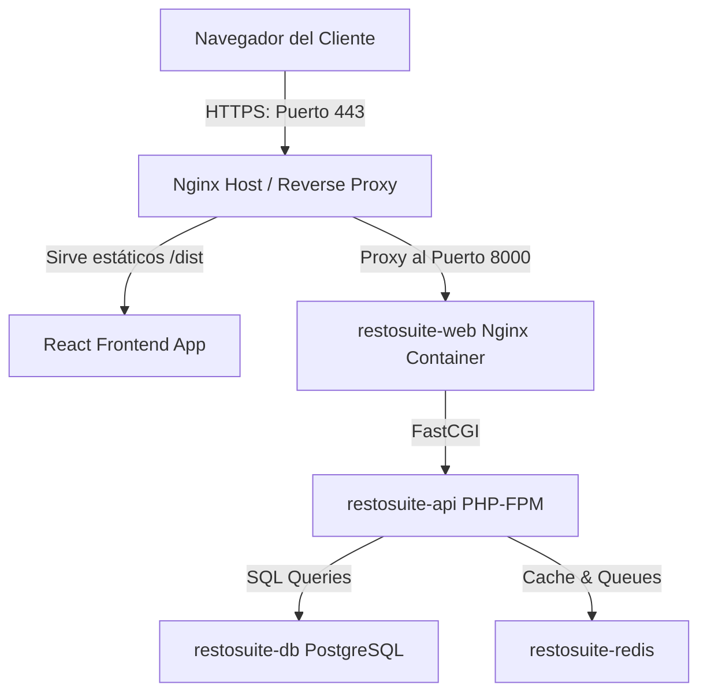

# Guía de Despliegue en Producción - RestoSuite

Esta guía detalla los pasos y configuraciones recomendadas para desplegar la arquitectura de **RestoSuite** (Frontend en React/Vite y Backend API en Laravel) en un entorno de producción (VPS, Servidor Dedicado o Nube).

---

## Arquitectura de Producción Recomendada



---

## 1. Despliegue del Frontend (React + Vite)

Dado que es una aplicación compilada (SPA - Single Page Application), la mejor forma de desplegarla es compilando los recursos y sirviendo los archivos estáticos mediante un servidor web rápido como Nginx.

### Paso 1: Configurar Variables de Entorno de Producción
En el servidor o en tu entorno de CI/CD, crea el archivo `.env.production` en la carpeta `frontend/`:

```env
VITE_API_URL=https://api.tudominio.com/api
```
*(Reemplaza `https://api.tudominio.com` por el dominio o IP pública que apuntará a tu backend Laravel).*

### Paso 2: Compilar el Frontend
Instala dependencias y genera el build optimizado de producción:

```bash
cd frontend
npm install
npm run build
```
Esto creará una carpeta llamada `dist/` en `frontend/` que contiene todos los archivos estáticos de la aplicación (HTML, CSS minificado, JS en bundles y assets).

### Paso 3: Configurar Nginx para Servir el Frontend
Para evitar que se pierdan las rutas de React Router al refrescar la página, el servidor Nginx debe configurarse con fallback a `index.html`. Aquí tienes una plantilla de configuración de Nginx:

```nginx
server {
    listen 80;
    server_name tudominio.com; # Tu dominio principal

    root /var/www/sistema_restaurante/frontend/dist;
    index index.html;

    location / {
        try_files $uri $uri/ /index.html;
    }

    # Habilitar compresión Gzip para mayor velocidad
    gzip on;
    gzip_types text/plain text/css application/json application/javascript text/xml application/xml;
    gzip_min_length 1000;
}
```

---

## 2. Despliegue del Backend (Laravel API - Docker)

El backend viene preconfigurado con Docker, lo cual hace que el despliegue sea uniforme y aislado.

### Paso 1: Preparar el Archivo `.env` en la Carpeta `backend/`
Crea el archivo `.env` definitivo en la carpeta `backend/`. Asegúrate de deshabilitar el modo debug por seguridad y configurar claves seguras:

```env
APP_NAME=RestoSuite
APP_ENV=production
APP_DEBUG=false
APP_URL=https://api.tudominio.com

LOG_CHANNEL=stack
LOG_DEPRECATIONS_CHANNEL=null
LOG_LEVEL=error

# Conexión de base de datos (Docker Compose maneja el host 'db')
DB_CONNECTION=pgsql
DB_HOST=db
DB_PORT=5432
DB_DATABASE=restosuite_db
DB_USERNAME=restosuite_user
DB_PASSWORD=EscribeUnaContrasenaMuySeguraAqui

# Caché y Colas mediante Redis (Docker Compose maneja el host 'redis')
BROADCAST_DRIVER=log
CACHE_DRIVER=redis
FILESYSTEM_DISK=public
QUEUE_CONNECTION=redis
SESSION_DRIVER=redis

REDIS_HOST=redis
REDIS_PASSWORD=null
REDIS_PORT=6379
```

### Paso 2: Ajustar docker-compose.yml para Producción
En producción, querrás cambiar los puertos expuestos de la base de datos y Redis para que no sean accesibles públicamente a Internet, dejando que solo los contenedores de la red interna se comuniquen entre sí.

Edita la sección de puertos en el archivo `docker-compose.yml` en la raíz del proyecto:
* **db**: Elimina `"5432:5432"` o cámbialo a `"127.0.0.1:5432:5432"` si requieres conectarte remotamente.
* **redis**: Elimina `"6379:6379"`.

### Paso 3: Construir y Levantar los Contenedores
Ejecuta el siguiente comando en la raíz del proyecto para construir las imágenes con las optimizaciones de producción y levantar los servicios en segundo plano (`-d`):

```bash
docker compose up -d --build
```

### Paso 4: Inicializar la Aplicación (Migraciones y Claves)
Con los contenedores corriendo, ejecuta las siguientes tareas administrativas dentro del contenedor de la API (`restosuite-api`):

1. **Generar la clave de la aplicación:**
   ```bash
   docker exec -it restosuite-api php artisan key:generate
   ```
2. **Crear el enlace simbólico para imágenes de platos:**
   ```bash
   docker exec -it restosuite-api php artisan storage:link
   ```
3. **Ejecutar migraciones y seeders iniciales:**
   ```bash
   docker exec -it restosuite-api php artisan migrate --force
   docker exec -it restosuite-api php artisan db:seed --force
   ```
4. **Optimizar la carga (Caché de rutas y configuración):**
   ```bash
   docker exec -it restosuite-api php artisan config:cache
   docker exec -it restosuite-api php artisan route:cache
   docker exec -it restosuite-api php artisan view:cache
   ```

---

## 3. Configuración de HTTPS / SSL (Certbot y Let's Encrypt)

Es obligatorio que las peticiones entre el frontend y el backend viajen encriptadas en producción (HTTPS) para evitar el bloqueo de navegadores por contenido mixto.

Puedes utilizar **Certbot** en tu máquina host para generar certificados SSL gratuitos.

### Instalar Certbot en Ubuntu/Debian:
```bash
sudo apt update
sudo apt install certbot python3-certbot-nginx
```

### Obtener el certificado SSL automáticamente para tus dominios:
```bash
sudo certbot --nginx -d tudominio.com -d api.tudominio.com
```
Certbot modificará los archivos de configuración de Nginx agregando las directivas SSL y redireccionará automáticamente el tráfico HTTP (puerto 80) a HTTPS (puerto 443).

---

## 4. Mantenimiento y Respaldos

### Respaldar la Base de Datos (PostgreSQL en Docker)
Crea una tarea programada (cron job) en tu host para respaldar la base de datos periódicamente:

```bash
# Comando para exportar la BD en un archivo .sql comprimido
docker exec -t restosuite-db pg_dumpall -U restosuite_user | gzip > /ruta/de/respaldos/backup_$(date +%F).sql.gz
```

### Ver Logs en Producción
Para monitorear el backend en tiempo real ante posibles incidencias de usuarios:
```bash
# Logs de los contenedores
docker compose logs -f app

# Logs específicos de Laravel
tail -f backend/storage/logs/laravel.log
```

---

## 5. Despliegue Simplificado en Render (Recomendado)

Si no deseas configurar un VPS propio con Docker y Nginx, puedes desplegar **RestoSuite** en **Render** utilizando el archivo Blueprint `render.yaml` preconfigurado en la raíz del proyecto. Esto creará toda la arquitectura (Frontend, Backend, Base de Datos PostgreSQL y Redis) automáticamente.

### Paso 1: Subir el Proyecto a GitHub / GitLab
Asegúrate de que todo tu código esté subido a un repositorio privado de GitHub o GitLab.

### Paso 2: Crear el Blueprint en Render
1. Inicia sesión en [Render](https://render.com/).
2. Haz clic en **New +** y selecciona **Blueprint**.
3. Conecta tu repositorio de GitHub/GitLab que contiene RestoSuite.
4. Render leerá el archivo `render.yaml` automáticamente y te mostrará la lista de recursos a crear:
   * **restosuite-db** (Base de Datos PostgreSQL)
   * **restosuite-redis** (Caché y sesiones)
   * **restosuite-api** (Laravel API - Web Service PHP)
   * **restosuite-frontend** (React/Vite - Static Site)
5. En la variable `VITE_API_URL` del servicio frontend, una vez que se cree la API, puedes configurarla en la interfaz de Render con la ruta final de la API agregándole `/api` al final (por ejemplo: `https://restosuite-api.onrender.com/api`).
6. Haz clic en **Apply** (Aplicar) para iniciar el aprovisionamiento.

### Paso 3: Inicializar Base de Datos (Semillas)
Como es la primera vez que se monta la base de datos, debes ejecutar el seeder para crear las cuentas de administrador, mozo y cajero:
1. En el panel de Render, entra al servicio **restosuite-api**.
2. Ve a la pestaña **Shell** (consola interactiva).
3. Ejecuta el comando:
   ```bash
   php backend/artisan db:seed --force
   ```
4. ¡Listo! Ya puedes ingresar al sistema desde la URL provista por el servicio **restosuite-frontend**.

### Paso 4: Seguridad Importante en Render
* **Modo de Imágenes:** En Render, utiliza siempre la pestaña **"URL"** para subir fotos de platos para que no se pierdan cuando el servidor se reinicie. Subir fotos locales de forma gratuita causará que se borren eventualmente.
* **CORS Dinámico:** El backend está configurado para aceptar peticiones solo desde el origen de tu frontend en Render gracias a la variable de entorno `ALLOWED_ORIGINS` autoconfigurada en el blueprint.
* **HTTPS:** Render maneja de forma automática los certificados SSL (HTTPS), y el archivo `AppServiceProvider.php` forzará a que todos los enlaces internos de Laravel viajen seguros.
